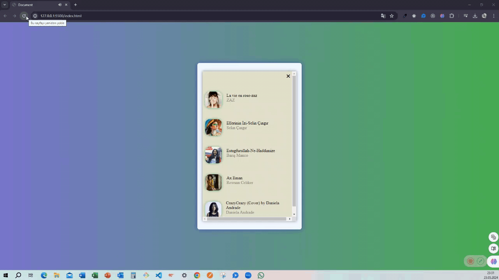

<h1> Playlist Project </h1>

Bu depo, kullanıcıların müzik çalma listelerini oluşturmasına ve paylaşmasına olanak tanıyan bir proje içermektedir. Proje, müzik severlerin favori şarkılarını ve sanatçılarını keşfetmelerine ve başkalarıyla paylaşmalarına olanak tanır. Aynı zamanda, kullanıcıların çeşitli müzik tarzlarını ve türlerini keşfetmelerine yardımcı olmak için önerilen çalma listeleri sunar.  

<h1> Özellikler </h1>

-  Çalma Listesi Oluşturma: Kullanıcıların kendi çalma listelerini oluşturmalarına ve şarkılarını eklemelerine olanak tanır. 
-  Çalma Listesi Paylaşma: Kullanıcıların oluşturdukları çalma listelerini diğer kullanıcılarla paylaşmalarına olanak tanır. 

-  Önerilen Çalma Listeleri: Kullanıcılara çeşitli müzik tarzlarında önerilen çalma listeleri sunar. 

-  Arama ve Filtreleme: Kullanıcıların şarkılar ve çalma listeleri arasında arama yapmalarını ve filtreleme yapmalarını sağlar. 

<h1> Kullanılan Teknojiler </h1>

-   HTML5  
-   Css  
-   JavaScript  

<h1> Ekran Görünütüsü</h1>

